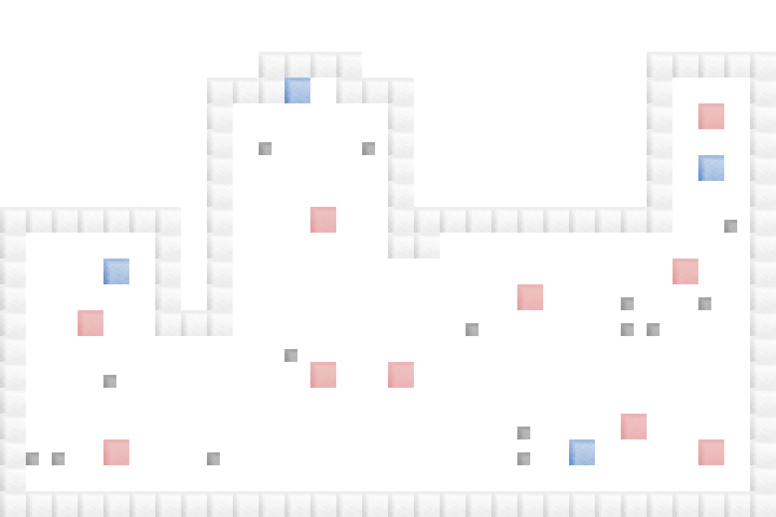

# OpenAI-LUCI-AMPS


## Overview
This is a 2D simulator made with https://www.ursinaengine.org/ This engine allows both 2D and 3D physics and simulation written entirely in python.


The "game" consists of multiple entity types. The following are supported

| Entity    | Description | Characteristic |
| -------- | ------- | -------- |
| Person  | A random actor that simulates a single person in a crowd    | walk time, wait time |
| Cart | The vehicle used to transport a Person type    | start location, goal location, drive time, charge state, trips made|
| Kiosk    | Central locations (static) that a Person can call a Cart from    | users used, waiting on ride, wait time |


## Maps

The map is generated from a provided .tmx file made by [Tiled](https://www.mapeditor.org/) this provides a standardized way to represent a grid map and has support for loading in existing floor plans to generate the tmx file type. The .tmx file type is a well established standard in 2D game dev for representing levels. 


## Running 

It is recommended to use a Python virtenv when installing packages

```
sudo apt install python3-virtualenv
python3 -m virtualenv .env
source .env/bin/activate
pip3 install -r requirements.txt
```

Then to run the sim 

```
python3 sim_ursina.py 
```

The cart can be controlled with the standard wasd keys.